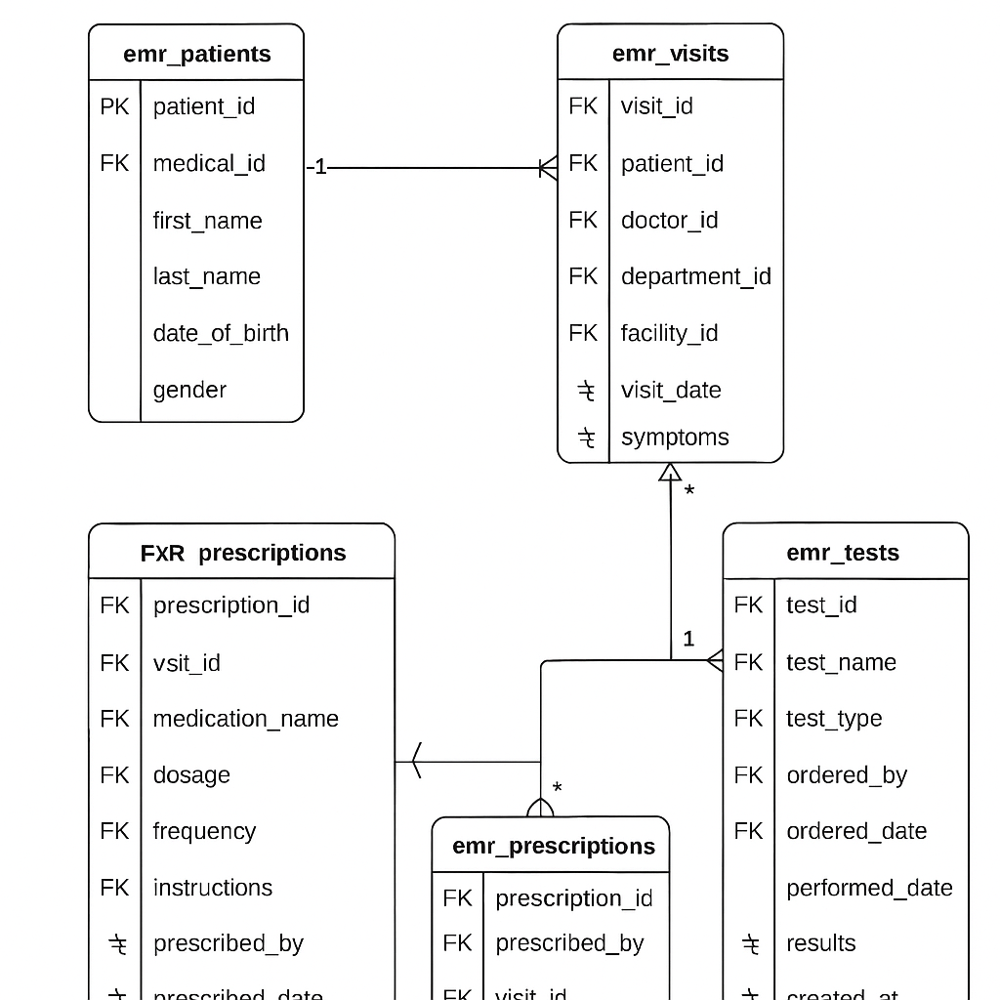

# Week 15
## Day 73: Kết nối Python và MySQL server
## Day 74: Python & MySQL Server
## Day 75: Thiết kế CSDL cho hệ thống EMR
### 1. Đặt vấn đề:
EMR là thành phần trọng yếu trong hệ sinh thái số hóa y tế, đóng vai trò trung tâm trong việc lưu trữ, quản lý và truy xuất thông tin bệnh nhân một cách hiệu quả, bước khởi đầu mang tính nền tảng là phân tích nghiệp vụ và thiết kế DB hợp lý, có khả năng mô hình hóa chính xác các thực thể và mối liên hệ trong bối cảnh lâm sàng.
### 2. Thiết kế CSDL

