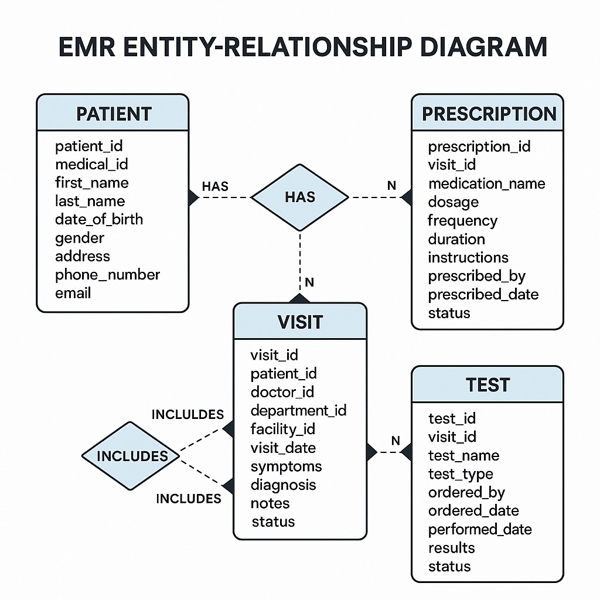
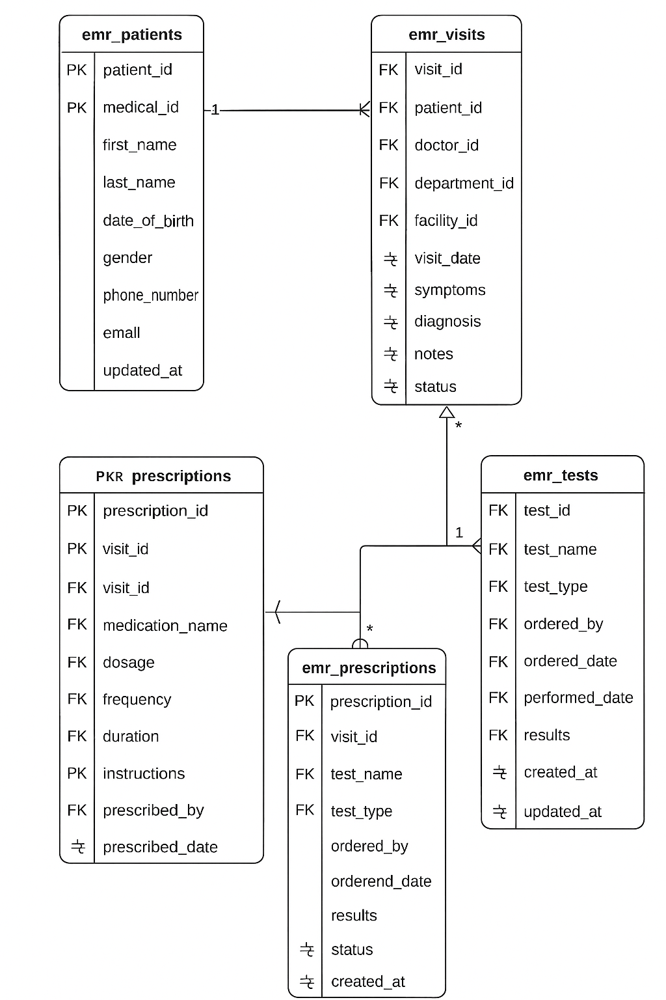

# Week 15
## Day 73: Kết nối Python và MySQL server
## Day 74: Python & MySQL Server
## Day 75: Thiết kế CSDL cho hệ thống EMR
### 1. Đặt vấn đề:
EMR là thành phần trọng yếu trong hệ sinh thái số hóa y tế, đóng vai trò trung tâm trong việc lưu trữ, quản lý và truy xuất thông tin bệnh nhân một cách hiệu quả, bước khởi đầu mang tính nền tảng là phân tích nghiệp vụ và thiết kế DB hợp lý, có khả năng mô hình hóa chính xác các thực thể và mối liên hệ trong bối cảnh lâm sàng.
### 2. Thiết kế CSDL

## Day 76: Thiết kế và triển khai API cho hệ thống EMR sử dụng FastAPI
### 1. Mục tiêu
- Tạo mô hình truy xuất dữ liệu hồ sơ bệnh án theo mô hình REST
- Phân tách rõ lớp database và API/service
- Hỗ trợ các thao tác CRUD (Create/Read/Update/Delete) đối với từng thực thể dữ liệu trong hệ thống EMR
- Tạo tài liệu tương tác tự động (Swagger UI) nhằm hỗ trợ thử nghiệm và phát triển mở rộng
## 2. Kiến trúc tích hợp cơ bản
- Data Models: Ánh xạ các bảng trong DB vào các lớp Python thông qua Pydantic
- Database Layer: Thực hiện các truy vấn SQL tương tác với hệ thống DBMS
- Lớp API (Router): Định nghĩa các endpoint RESTful phục vụ truy cập từ phía client
Việc tổ chức mã nguồn cần tuân theo nguyên tắc tách biệt mối quan tâm (Separation of Concenrns - SoC) nhằm tăng khả năng bảo trì, kiểm thử và mở rộng

## Day 77: Truy xuất thông tin bệnh nhân bằng Function Calling trong LLM và tích hợp với hệ thống API y tế
### 1. Mục tiêu
Sử dụng Function Calling trong ChatGPT/Gemini để thực hiện truy vấn dữ liệu bệnh nhân từ hệ thống API y tế xây dựng bằng FastAPI
### 2. Khái niệm Function Calling trong ngữ cảnh LLM
Đây là cơ chế cho phép LLM không chỉ phản hồi dưới dạng văn bản mà còn sinh ra lời gọi hàm (function call) có cấu trúc, thường là JSON, dựa trên schema do nhà phát triển cung cấp. Khi được kết nối với một hệ thống backend, lời gọi này có thể được thực thi để truy xuất thông tin, từ đó trả về kết quả cho người dùng thông qua LLM
### 3. Áp dụng đối với bài toán EMR
1. đặc tả bài toán
Cho phép người dùng đặt câu hỏi tự nhiên nhằm tìm kiếm thông tin bệnh nhân dựa trên các tiêu chí:
- Họ tên
- Mã bệnh nhân
- Các đặc trưng khác
2. Luồng hoạt động
    1. Người dùng nhập câu hỏi
    2. Mô hình ChatGPT/Gemini nhận diện ý định và sinh function call dưới dạng JSON
    3. Hệ thống backend nhận lệnh và truy vấn API
    4. Kết quả được xử lý và phản hồi lại cho người dùng bằng ngôn ngữ tự nhiên